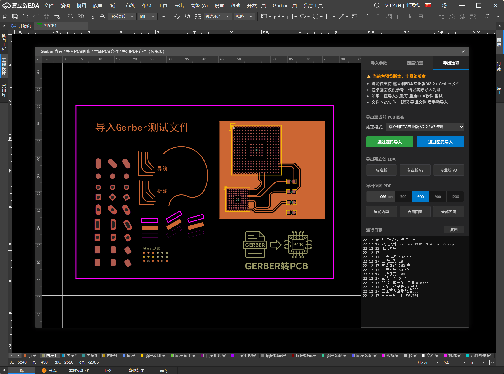

# Gerber 查看 / 导入PCB画布 / 生成PCB文件 / 导出PDF文件

本插件用于查看 Gerber 文件，并将其转换为 `嘉立创 EDA 专业版` 的PCB文件或 `直接导入编辑器画布`。完全离线运行，无需后端服务器。

## 使用方法

### [演示视频](https://pbt-pub.jlc.com/pbt/bbs/8707756117155397632-20260205_220643.mp4)

1. 在嘉立创 EDA 专业版中打开此工具。
2. 导入
    - **导入当前板子 Gerber 图形**：工具会自动调用 API 获取当前 PCB 的 Gerber 数据。
    - **导入 Gerber 压缩包 / 文件**：弹出文件选择窗口，选择 Gerber 压缩包 / 文件 导入。
    - 直接拖动文件到工具窗口
3. 配置：在右侧面板调整图层映射、单位及对应图层。
4. 调整参数后，在 `导出选项` 标签页中：
    * **通过源码导入**：生成的源码直接写入当前PCB，推荐，支持埋盲孔，可以撤销。
    * **通过图元导入**：调用 API 逐个创建图元，不支持埋盲孔，且无法完全撤回。
    * **导出嘉立创 EDA**：选择对应版本，导出对应版本的PCB文件
    * **导出位图 PDF**：选择需要的DPI（可自定义），生成对应分辨率的PDF，DPI越高越清晰

## 核心功能

* **多版本支持**：支持导出 **嘉立创EDA专业版 V2 和 V3** 格式的PCB文件。
* **API 集成**：在嘉立创EDA专业版客户端环境中，可直接通过 API 将图形注入当前 PCB 画布。
* **智能识别**：自动检测板层数量、板子类型（PCB/FPC）、坐标精度和单位。
* **Gerber 解析与渲染**：支持 RS-274X 格式，能解析光圈、宏、区域填充和钻孔文件。
* **智能图层识别**：通过文件名正则匹配（如 `*.GTL`, `*TopLayer*`）自动归类物理图层。
* **逆向还原算法**：这是代码的核心，它将 Gerber 的矢量图形（线段、圆弧、Flash）“智能聚合”为 EDA 的逻辑图元（焊盘、过孔、导线、填充等）。
* **多格式导出**：
  * **API 注入**：如果运行在 EDA 插件环境中，直接将图元写入当前画布。
  * **文件导出**：生成 `.epro2` (V3) 或 `.epcb` (V2) 的PCB文件。
  * **PDF 导出**：生成高质量的位图 PDF，支持分层或合并输出。

### 图元还原能力
#### 对嘉立创EDA专业版 V2.2 以上的版本，导出的 Gerber 文件支持最好

| Gerber 指令/形状 | 转换后的 EDA 图元 | 说明 |
| --- | --- | --- |
| **D03 (Flash) - Circle** | **PAD** / **VIA** | 自动识别为圆形焊盘或过孔。 |
| **D03 - Rect** | **PAD** (Rect) | 矩形焊盘。 |
| **D03 - Obround/Oval** | **PAD** (Oval) | 椭圆/长圆形焊盘。 |
| **G85 (Slot)** | **PAD** (Slot) | 槽孔识别，转换为带槽孔的焊盘。 |
| **Macro (RoundRect)** | **PAD** (RoundRect/Poly) | 支持圆角矩形，自动计算圆角半径或转换为多边形轮廓。 |
| **Macro (Polygon)** | **PAD** (Polygon) | 异形焊盘（如自定义形状）。 |
| **G01/G02/G03 (Line/Arc)** | **TRACK** / **ARC** | 具有宽度的线段转换为导线或圆弧。 |
| **G36/G37 (Region)** | **FILL** / **POLY** | 区域填充转换为实心填充 (Fill) 或多边形 (Poly)。 |
| **Drill Symbols** | **IMAGE** | 钻孔图层符号转换为矢量图片图元。 |
| **Text Strokes** | **POLY** (Lines) | 丝印文字通常由线段组成，会被还原为多段线 (Polyline)。 |

| 方式 | 通过源码导入 | 通过图元导入 | 生成专业版PCB | 生成标准版PCB |
| :---: | :---: | :---: | :---: | :---: |
| 矩形焊盘 | 支持 | 支持 | 支持 | 后续支持 |
| 圆形焊盘 | 支持 | 支持 | 支持 | 后续支持 |
| 自定义焊盘 | 支持 | 支持 | 支持 | 不支持 |
| 异形焊盘 | 支持 | 暂不支持 | 支持 | 后续支持 |
| 合并成组 | 支持 | 暂不支持 | 支持 | 不支持 |
| 导线 | 支持 | 支持 | 支持 | 后续支持 |
| 折线 | 支持 | 支持 | 支持 | 不支持 |
| 挖槽 | 支持 | 支持 | 支持 | 后续支持 |
| 槽孔 | 支持 | 支持 | 支持 | 后续支持 |
| 过孔 | 支持 | 支持 | 支持 | 后续支持 |
| 填充 | 支持 | 支持 | 支持 | 后续支持 |
| 文字 | 支持 | 支持 | 支持 | 后续支持 |
| 埋盲孔 | 支持 | 支持 | 支持 | 不支持 |
| 埋盲孔规则 | 支持 | 暂不支持 | 支持 | 不支持 |
| 矢量图片 | 支持 | 支持 | 支持 | 后续支持 |
| 真彩图片 | 后续支持 | 后续支持 | 后续支持 | 不支持 |
| FPC补强 | 后续支持 | 后续支持 | 后续支持 | 不支持 |
| 网络生成 | 后续支持 | 后续支持 | 后续支持 | 后续支持 |

注：通过图元导入埋盲孔之前需要手动添加埋盲孔规则

### 特殊功能支持

* **埋盲孔**: 支持手动指定钻孔文件的起始层和结束层（例如：`内层1` 到 `内层2`），生成对应的层对规则。
* **阻焊/助焊扩展**: 自动计算焊盘的阻焊和钢网扩展量。
* **坐标精度**: 可手动调整整数位和小数位，解决 Gerber 导入比例错误问题。

## 注意事项
### 务必在空白PCB文档里使用此功能，操作不当导致的数据丢失需自行负责
- 大量图元导入（如数万个图元）可能会导致EDA卡顿，建议导出PCB文件后再导入文件  
- 当前版本仅适配了 嘉立创EDA V2.2 版本以上导出的 Gerber 文件，其他软件导出的 Gerber 兼容性不详  
- 通过图元导入埋盲孔之前需要手动添加埋盲孔规则  
